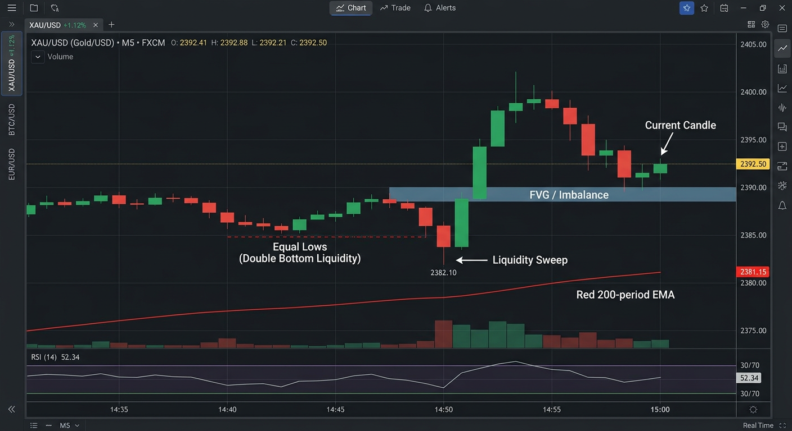

# 👻 Ghost rskIA

**Analyse tes captures de graphiques et reçois un plan de trade complet** — direction, entrée (marché ou "si le prix atteint X"), TP, SL, probabilité de réussite, confiance et explication — calqué sur la méthode de scalping SMC de **Kasper**.

## ✨ Fonctionnalités

- 📸 **Une capture suffit** : colle (`Ctrl+V`), glisse-dépose ou importe ta capture Pocket Option / MT5
- 🧠 **Méthode Kasper (SMC) intégrée** issue de sa formation 10h :
  - **FLUX** — structure Dow (HH/HL, LH/LL), CHoCH, moyenne mobile 200, RSI
  - **LIQUIDITÉ** — equal highs/lows, range asiatique (1h-6h) : *"la liquidité l'emporte toujours"*
  - **ZONE ★** — order block + imbalance (éliminatoire), BPR, FVG, breaker block, OTE Fibonacci 0.62-0.786
  - **SIGNAL** — englobante > pinbar > étoile du matin, volume en renfort
  - **Notation du setup en étoiles (1-5)** avec probabilité calibrée
- 📋 **Signaux prêts à copier** : format MT5 (Entrée/TP/SL/R:R) **et** Pocket Option (CALL/PUT + expiration)
- ⭐ **Checklist Flux/Zone/Signal** affichée pour chaque analyse
- 📖 **Guide intégré** : meilleures heures de trade, indicateurs à afficher, gestion du risque
- 🕘 **Historique** des 20 dernières analyses (stockées en local)
- 🎨 Interface noire glassmorphism bleu/cyan/vert, navigation mobile en bas d'écran
- 📊 **Tracker de résultats (journal Kasper)** : marque chaque trade WIN/LOSS → winrate global, par étoiles (★3/★4/★5), par direction, par actif, profit factor, P&L en R et série en cours
- 🥇 **Multi-captures** : analyse M1/M5 (exécution) **+** M15/H1 (contexte) ensemble — confluence multi-timeframes, étoiles renforcées
- 📰 **Filtre news en direct** : calendrier économique réel vérifié à chaque upload — bannière verte/ambre/rouge, et l'IA force ATTENDRE si une annonce 4-5★ tombe dans la fenêtre interdite
- 📲 **Bot Telegram** : envoie ta capture au bot → même analyse Kasper directement dans Telegram (`api/telegram.py`, webhook serverless)
- 🔑 **Bring your own key** : fonctionne avec *ta* clé API (Gemini **gratuit**, OpenAI, OpenRouter, Groq, ou endpoint compatible)

## 🚀 Utilisation

### Option 1 — En ligne (recommandé) 🚀
**[ghost-rskia.vercel.app](https://ghost-rskia.vercel.app)** — déployé sur Vercel, disponible partout. Sur mobile : *Ajouter à l'écran d'accueil* = vraie app.

### Option 2 — Fichier local
Ouvre `index.html` dans ton navigateur. App 100 % autonome (aucun build, aucune dépendance).

### Configurer ta clé API (2 min, gratuit)
1. Va sur **[aistudio.google.com](https://aistudio.google.com)** → *Get API key* → *Create API key* (aucune carte bancaire)
2. Dans l'app → onglet **Réglages** → colle la clé → **Enregistrer**
3. *(Option)* Pour la pré-charger : copie `key.example.js` en `key.local.js` et insère ta clé — ce fichier est **ignoré par git** et ne quitte jamais ton appareil.

> 🔒 **Aucune clé dans le code, par design** : chaque utilisateur saisit sa propre clé API dans l'onglet Réglages de l'app (stockée uniquement dans son navigateur, jamais envoyée ailleurs qu'au fournisseur d'IA choisi).

## 📖 Guide complet

Voir **[GUIDE.md](GUIDE.md)** — les meilleures heures de session (Londres 8h-10h, New York 15h30-17h30), les indicateurs à afficher avant la capture (MM200, RSI, volume, box Asian Session), la lecture des étoiles, et les règles de gestion du risque (1 %/trade, 3 SL = stop, jamais de martingale).

## 🗂️ Contenu du repo

| Fichier | Description |
|---|---|
| `index.html` | L'application complète (HTML/CSS/JS autonome) |
| `GUIDE.md` | Guide d'utilisation complet (heures, indicateurs, risque) |
| `key.example.js` | Modèle de pré-configuration de la clé API |
| `assets/` | Images de démo |
| `api/news.py` | Endpoint calendrier économique (Vercel serverless, CORS ouvert) |
| `api/telegram.py` | Bot Telegram (webhook serverless, même cerveau Kasper) |

## ☑️ Checklist avant chaque trade

- [ ] Bonne session ? (8h-10h ou 15h30-17h30, pas de news 4-5★ dans les 15 min)
- [ ] Setup ≥ 3★ ?
- [ ] Les 3 conditions Flux / Zone / Signal validées ?
- [ ] SL et TP placés **immédiatement** ?
- [ ] Risque ≤ 1 % du capital ?
- [ ] Stop de la journée si 3 pertes d'affilée ?

## ⚠️ Avertissement

Cet outil est une **aide à la décision**, pas un conseil financier. Aucune analyse — humaine ou IA — ne garantit un résultat. Les options binaires et le trading à effet de levier comportent un risque élevé de perte totale du capital. Teste d'abord en compte démo.

---

*Méthode d'analyse inspirée de la formation publique de Kasper (méthode Flux/Zone/Signal + concepts SMC). Projet indépendant, non affilié.*
